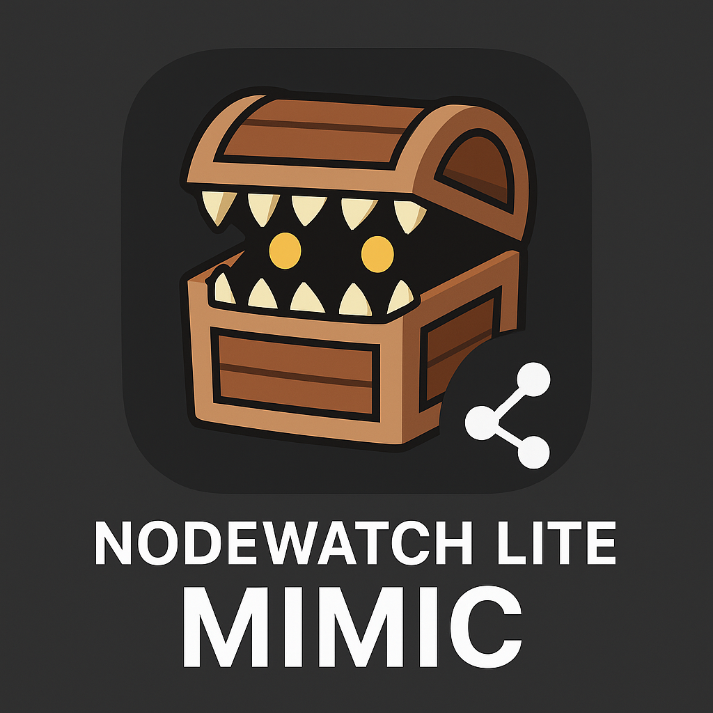

# NodeWatch Mimic Lite



NodeWatchのものまねをする、最小構成のNode.jsアプリです。  
以下のエンドポイントのみ対応しています。

- `/api/symbol/height`
- `/api/symbol/nodes/peer`

## 必要要件

- Node.js 22.x
- Yarn 4.x

## セットアップ

```bash
yarn install
```

または

```bash
npm install
```

```bash
cp .env.mainnet .env
```

### クローラー

cronで定期的に(10分毎など) `scripts/crawler.sh` が起動するように設定してください。

```bash
crontab -e
```

```cron
*/10 * * * * /usr/bin/sh /path/to/nodewatch-mimic-lite/scripts/crawler.sh
```

voltaなどを使用している場合は環境変数を設定します。

```cron
*/10 * * * * PATH=$HOME/.volta/bin:$PATH /usr/bin/sh /path/to/nodewatch-mimic-lite/scripts/crawler.sh
```

初回はデータが無いのでクローラーを手動で起動しておいた方がよいでしょう。

```bash
scripts/crawler.sh
```

## 起動方法

```bash
yarn start:web
```

デフォルトで `http://localhost:3000` で起動します。

## 停止方法

```bash
yarn stop:web
```

## ライセンス

Apache-2.0 license
